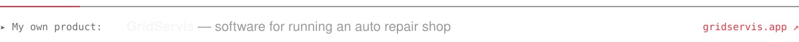

 

I'm a freelance developer from Rajec, Slovakia. I build custom websites and systems for sports clubs, restaurants and small businesses — from the first wireframe to the final deploy. I care about things that look expensive, load fast and don't break.

Most of my days are spent in TypeScript. After hours I tinker with ESP32 and Arduino, and away from the screen you'll find me at the football pitch.

 

 

 

  Got a project in mind? Get in touch — I reply within 24 hours. 
  <a href="https://strananekm.com"><b>strananekm.com</b></a> &nbsp;·&nbsp; <a href="mailto:strananekm@gmail.com"><b>strananekm@gmail.com</b></a>

